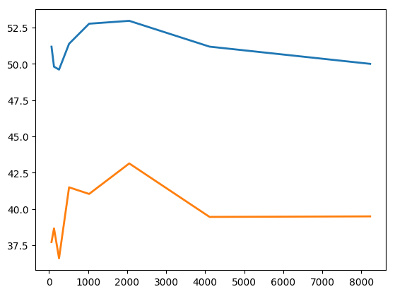

Procesamiento de Lenguaje Natural - UBA 2018
============================================
 
:Author: Bianchetti, Marcelo Luis
 
Trabajo Practico N 3
--------------------
 
- Ejercicio 1.
 
 Genere un script stats que levanta de configs.py los paths para los corpus de tweets que baje de la pagina TODO. Los resultados, utilizando len de lista y la clase Counter de la libreria collections, son los siguientes:

 *GeneralTASS train tweets*

  **Total amount of tweets**: 7219
 
  :Counter: { **P+** : 1652, **NONE** : 1483, **N** : 1335, **P** : 1232, **N+** : 847, **NEU** : 670 }

 *InterTASS train tweets*

  **Total amount of tweets**: 1008
 
  :Counter: { **N** : 418, **P** : 318, **NONE** : 139, **NEU** : 133 }

- Ejercicio 2.

 Para este ejercicio modifico la clase train para que levante los paths de configs.py, al igual que para el ejercicio anterior; mejoro el script de curve.py a fin de que con los valores calculados genere graficos usando la libreria matplotlib (realizo un chequeo del sistema operativo, a fin de no necesitar instalar python como framework y poder usarlo desde el pyenv). Los graficos son almacenados en la carpeta *graphs* con extensión *.png* y con el nombre del modelo y el clasificador utilizado (en caso de corresponder). El nombre del modelo, en caso de usar *clf* lo obtengo directamente de la clase mediante el metodo **name()**. La idea de esto es poder variar el mismo segun las mejoras aplicadas a la clase.

 **Resultados:**

 **clf sin mejoras con maxent**
 
 :Sentiment P:
  Precision: 52.89% (119/225)
  Recall: 76.28% (119/156)
  F1: 62.47%

 :Sentiment N:
  Precision: 60.65% (131/216)
  Recall: 59.82% (131/219)
  F1: 60.23%

 :Sentiment NEU:
  Precision: 15.79% (3/19)
  Recall: 4.35% (3/69)
  F1: 6.82%

 :Sentiment NONE:
  Precision: 28.26% (13/46)
  Recall: 20.97% (13/62)
  F1: 24.07%

 :Accuracy: 52.57% (266/506)
 :Macro-Precision: 39.40%
 :Macro-Recall: 40.35%
 :Macro-F1: 39.87%

 **Confusion Matrix:**

 ==== === === === ====
 \    P   N   NEU NONE
 ==== === === === ====
 P    119 27  5   5
 N    60  131 7   21
 NEU  30  29  3   7
 NONE 16  29  4   13
 ==== === === === ====

 .. image:: graphs/clf_basic_maxent.png

 **clf con mejor tokenizer con maxent**

 :Sentiment P:
  Precision: 52.94% (108/204)
  Recall: 69.23% (108/156)
  F1: 60.00%
 :Sentiment N:
  Precision: 61.29% (133/217)
  Recall: 60.73% (133/219)
  F1: 61.01%
 :Sentiment NEU:
  Precision: 27.78% (5/18)
  Recall: 7.25% (5/69)
  F1: 11.49%
 :Sentiment NONE:
  Precision: 23.88% (16/67)
  Recall: 25.81% (16/62)
  F1: 24.81%
 :Accuracy: 51.78% (262/506)
 :Macro-Precision: 41.47%
 :Macro-Recall: 40.75%
 :Macro-F1: 41.11%

 ==== === === === ====
 clf con mejor tokenizer con maxent
 ---------------------
 \    P   N   NEU NONE
 ==== === === === ====
 P    108 30  5   13  
 N    54  133 6   26  
 NEU  26  26  5   12 
 NONE 16  28  2   16
 ==== === === === ====

 .. image:: graphs/clf_tkn_maxent.png

 **clf con mejor tokenizer con svm**

 :Sentiment P:
  Precision: 55.43% (102/184)
  Recall: 65.38% (102/156)
  F1: 60.00%
 :Sentiment N:
  Precision: 63.18% (127/201)
  Recall: 57.99% (127/219)
  F1: 60.48%
 :Sentiment NEU:
  Precision: 13.51% (5/37)
  Recall: 7.25% (5/69)
  F1: 9.43%
 :Sentiment NONE:
  Precision: 22.62% (19/84)
  Recall: 30.65% (19/62)
  F1: 26.03%
 :Accuracy: 50.00% (253/506)
 :Macro-Precision: 38.69%
 :Macro-Recall: 40.32%
 :Macro-F1: 39.49%

 ==== === === === ====
 clf con mejor tokenizer con svm
 ---------------------
 \    P   N   NEU NONE
 ==== === === === ====
 P    102 27  10  17  
 N    44  127 14  34  
 NEU  26  24  5   14  
 NONE 12  23  8   19 
 ==== === === === ====

**clf con mejor tokenizer con mnb**

 :Sentiment P:
  Precision: 50.00% (134/268)
  Recall: 85.90% (134/156)
  F1: 63.21%
 :Sentiment N:
  Precision: 61.86% (146/236)
  Recall: 66.67% (146/219)
  F1: 64.18%
 :Sentiment NEU:
  Precision: 100.00% (0/0)
  Recall: 0.00% (0/69)
  F1: 0.00%
 :Sentiment NONE:
  Precision: 100.00% (2/2)
  Recall: 3.23% (2/62)
  F1: 6.25%
 :Accuracy: 55.73% (282/506)
 :Macro-Precision: 77.97%
 :Macro-Recall: 38.95%
 :Macro-F1: 51.95%

 ==== === === === ====
 clf con mejor tokenizer con mnb
 ---------------------
 \    P   N   NEU NONE
 ==== === === === ====
 P    134 22  0   0  
 N    73  146 0   0  
 NEU  37  32  0   0 
 NONE 24  36  0   2
 ==== === === === ====

 .. image:: graphs/clf_tkn_mnb.png

